# I-service

## iService is a full-stack digital web platform that connects users with verified artisans for home and professional services. This repository contains both the frontend and backend codebase, structured for scalability, maintainability, and team collaboration.

```mermaid
flowchart TD
    %% Landing and Account
    A([Landing Page]) --> B{Have Account?}
    B -->|No| C(Sign Up)
    B -->|Yes| D(Login)
    C --> E(Create Profile)
    E --> F[Dashboard]
    D --> F
    
    %% Dashboard Options
    F --> G((Browse Service Categories))
    F --> H((Search for Services))
    
    G --> J[Apply Filters]
    H --> J
    
    %% Provider Selection
    J --> K[View Service Results]
    K --> L[Select Service Provider]
    L --> M[View Provider Profile]
    M --> N{Book This Provider?}
    N -->|No| K
    N -->|Yes| O{Check Availability}
    
    %% Booking Flow
    O -->|Available| P[Book Service]
    O -->|Not Available| K
    P --> Q(Confirm Booking Details)
    Q --> R(Select Payment Method)
    R --> S(Process Payment)
    S --> T(Receive Booking Confirmation)
    
    %% Service Delivery
    T --> U[Service Delivery]
    U --> V((Receive Service))
    V --> W((Submit Review & Rating))
    
    %% Post-Service
    T --> X((View Receipt))
    X --> Y((View Booking History))
    Y --> Z((Track Current Bookings))
    
    %% Styling
    classDef start fill:#4da6ff,stroke:#004080,stroke-width:2px,color:#fff
    classDef account fill:#e63946,stroke:#800000,stroke-width:2px,color:#fff
    classDef action fill:#4caf50,stroke:#2e7d32,stroke-width:2px,color:#fff
    classDef dashboard fill:#ff9800,stroke:#e65100,stroke-width:2px,color:#fff
    classDef option fill:#b388ff,stroke:#4a148c,stroke-width:2px,color:#000
    classDef process fill:#26c6da,stroke:#006064,stroke-width:2px,color:#fff
    classDef decision fill:#e53935,stroke:#8e0000,stroke-width:2px,color:#fff
    classDef book fill:#f06292,stroke:#880e4f,stroke-width:2px,color:#fff
    classDef payment fill:#f8bbd0,stroke:#ad1457,stroke-width:2px,color:#000
    classDef delivery fill:#424242,stroke:#000,stroke-width:2px,color:#fff
    classDef endnode fill:#9e9e9e,stroke:#424242,stroke-width:2px,color:#fff
    
    class A start
    class B,N,O decision
    class C,D,E action
    class F dashboard
    class G,H option
    class J,K,L,M process
    class P,Q book
    class R,S,T payment
    class U delivery
    class V,W,X,Y,Z endnode
```

